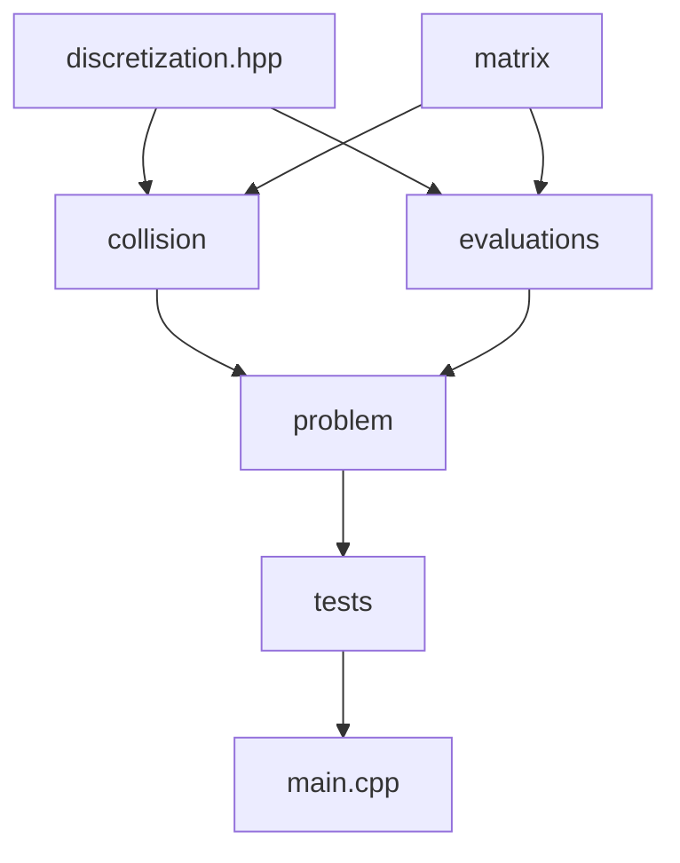
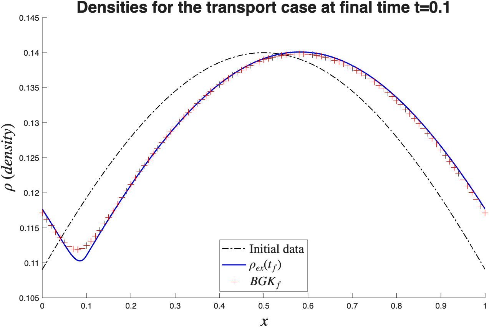
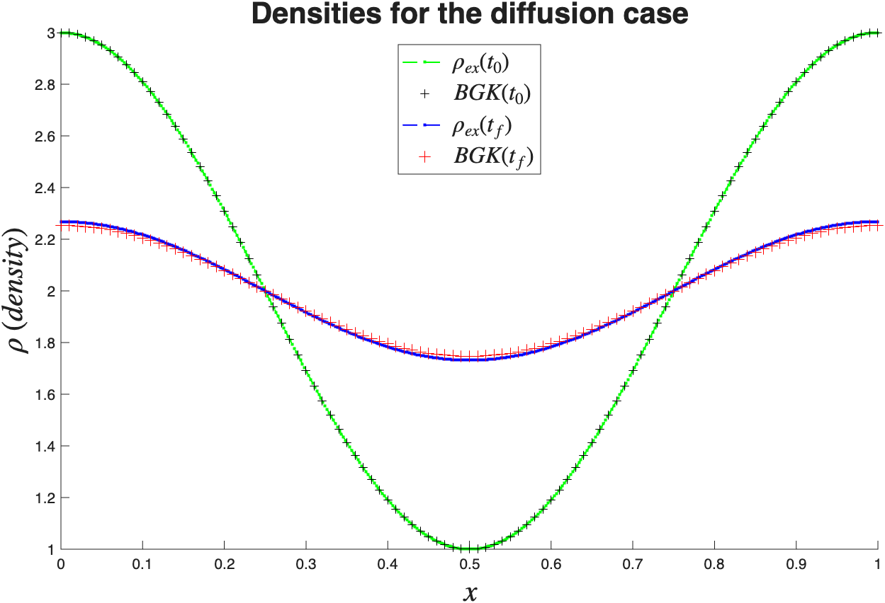
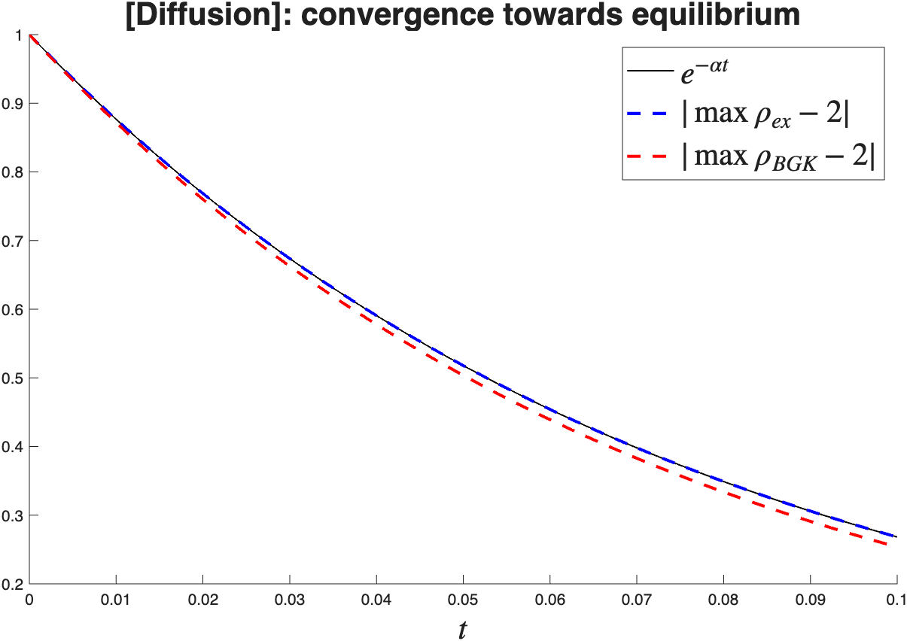

# \[In Progress\] Unified Gas Kinetic Scheme (UGKS) : implementation of a generalization in the diffusive limit

## Description

The goal of this project is to implement in C++ the method described in [*GENERALIZED UGK SCHEME IN THE DIFFUSIVE LIMIT*](https://arxiv.org/abs/2507.03385)  written by [Nicolas CROUSEILLES](https://people.rennes.inria.fr/Nicolas.Crouseilles/), [Julien MATHIAUD](https://julienmathiaud.perso.math.cnrs.fr/), and [Luc MIEUSSENS](https://www.math.u-bordeaux.fr/~lmieusse/index.html). This project is supervised by Julien Mathiaud.

## Code architecture

*File name with out extension (.hpp or .cpp) means that there are both .hpp and .cpp files.*

## Progress

- Implemented finite volume method for the BGK collision operator.

  - Tested on transport case :
    

  - Tested on diffusion case :
    

  - Checked convergence towards equilibrium :
    

## Documentation

I used Doxygen, you can find the documentation on this [repo's github page](https://jeanpousset.github.io/UGKS-Implentation-Cpp/md_README.html)

## Bibliography
Crouseilles, Nicolas & Julien, Mathiaud & Mieussens, Luc. (2025). Generalized UGK scheme in the diffusive limit. 10.48550/arXiv.2507.03385. [ArXiv link](https://arxiv.org/abs/2507.03385)

